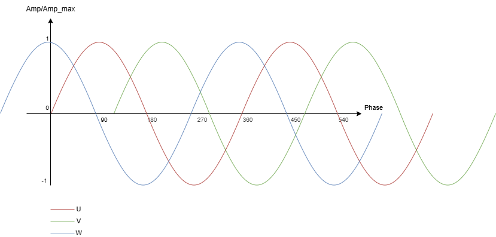
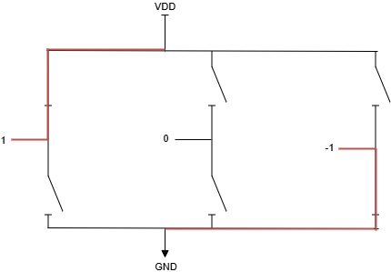
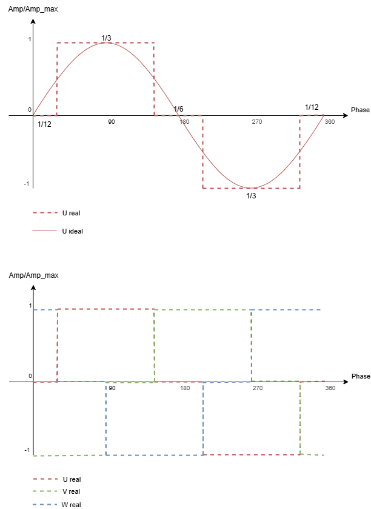
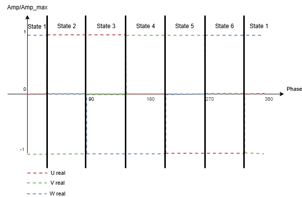

# First Control of Brushless 4-Pole DC Motor

## Purpose

This project is a prototype of a Brushless Motor Controller. The purpose of this prototype has two main motivations: **personal learning** and **advancement of the Hydrojet project**.

The goal of this prototype is to create an initial architecture for motor control that can be easily updated and adapted to other motors. This will be achieved using a low-cost microcontroller (MCU) as a proof of concept. No PCB will be designed at this stage.

### Project Objectives

- Create an initial firmware for motor control
- Design an initial architecture for motor control using a microcontroller
- Identify the limitations of this type of control method (RPM vs magnetic RPM, torque, power, noise, size, cost, etc.)

### Personal Objectives

- Refresh skills with KiCad
- Build a professional-quality electrical project from scratch

## Mid-term Objectives

- [ ] **Firmware**
    - [x] Acquire microcontrollers (MCUs)
    - [x] Connect and run initial "blink" code
    - [ ] Develop first code iteration
    - [ ] Validate timing accuracy
    - [ ] Creat Dedicated library

- [ ] **Electrical Design**
    - [x] Define initial architecture
    - [ ] Implement safety features
    - [ ] Generate Bill of Materials (BOM)
    - [ ] Assemble first board (veroboard)

- [ ] **Test Bench**
    - [ ] Define and build the test setup
    - [ ] Validate performance and measurements

## Command

A simplified architecture of a brushless DC (BLDC) motor controller uses three half-bridges (pairs of switches) driving the three inductors (motor windings) connected in a star (Y) configuration:

Ideally, each phase is driven by a sinusoidal voltage; the three waveforms are phase-shifted by 120°, which ensures smooth rotation and high efficiency:

However, with this controller architecture we can only apply three discrete levels to each phase: **−1, 0, +1**.  
(Here, **+1** means the phase is connected to +Vdc, **−1** to −Vdc (or ground), and **0** is high-impedance / floating.)

Each level corresponds to a combination of switch positions within a single phase leg:

This discretization produces “digital” drive waveforms:

Because at any instant one phase is driven high, one low, and one is floating, there are **six** distinct commutation states:

### Phase levels per state

| Phase \ State |  1  |  2  |  3  |  4  |  5  |  6  |
|:-------------:|:---:|:---:|:---:|:---:|:---:|:---:|
| **U**         |  0  |  1  |  1  |  0  | −1  | −1  |
| **V**         | −1  | −1  |  0  |  1  |  1  |  0  |
| **W**         |  1  |  0  | −1  | −1  |  0  |  1  |

### Switch table per state

Let the six switches be:
- **S1** = U high-side, **S2** = U low-side  
- **S3** = V high-side, **S4** = V low-side  
- **S5** = W high-side, **S6** = W low-side

| Switch \ State |   1  |   2  |   3  |   4  |   5  |   6  |
|:--------------:|:----:|:----:|:----:|:----:|:----:|:----:|
| **S1 (U+)**    | off  | on   | on   | off  | off  | off  |
| **S2 (U−)**    | off  | off  | off  | off  | on   | on   |
| **S3 (V+)**    | off  | off  | off  | on   | on   | off  |
| **S4 (V−)**    | on   | on   | off  | off  | off  | off  |
| **S5 (W+)**    | on   | off  | off  | off  | off  | on   |
| **S6 (W−)**    | off  | off  | on   | on   | off  | off  |

*Note:* “off” = open (non-conducting), “on” = closed (conducting).

## Architecture

### Schematics

(Here you can insert or link your schematic diagrams.)

### Firmware

(Here you can describe your firmware architecture or link to relevant code.)

## Tests

(Here you will document your testing methodology and results.)
