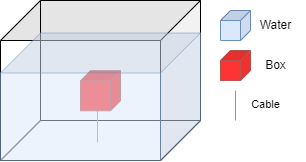

# Waterproof Enclosure Research

## Introduction

This research aims to test the waterproofing potential of a 3D-printed enclosure.

### Advantages of a 3D-printed solution:
- Low cost
- Easy to iterate and modify
- Wide range of possible shapes and customizations

### Main drawback:
Filament-based 3D printing (FDM/FFF) is known to produce parts that are inherently porous and may not be watertight without additional processing.

## Materials

The materials selected for this study are:

- **PETG HF** (High Flow): Chosen for its ease of printing and good mechanical resistance. Bambu Lab’s PETG HF will be used to evaluate basic feasibility.
- **Translucent PETG**: Used to visually inspect for water infiltration or micro-leaks.

PETG is generally known for its better water resistance compared to PLA and is a good candidate for underwater or damp environments.

Many variable can be change in order to check for any improovement if needed :

- **Wall width** : adding more layers of material or changing the infill could hellp block water
- **Printing temperature** : increasing themperature could help decrease porosity
- **Printing speed** :
- **Post processing** :
    - dichtol (Diamant)
    - polymer

## Test Methodology

The waterproofness test will initially be conducted under static, submerged conditions.

A test box will be designed and 3D-printed with a hook or attachment point to allow easy suspension. The box will be fully submerged in water and left underwater for **24 hours**.

### Test Setup:
- The box will be reviously wheight befor the experiment.
- The box will be securely fixed 10cm underwater to prevent floating or movement during the test.
- The box will be wheight asecond time to check for any increase in wheight

### Visual Reference:

