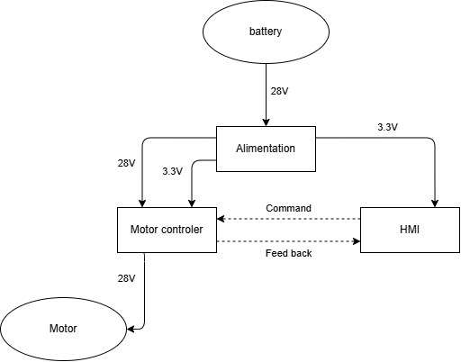

# Hydro Propulsor Project

## General Description and Context

This project aims to create a portable, affordable, and user-friendly hydro propulsor.  
It is a solo, free-time project developed as a learning experience to improve my skills in:

- Motor control
- Mechanical design
- Technical documentation
- Project management

Every part of the project will be made available in this repository.  
I'll keep improving its usability and documentation as the project evolves.
The objective is to only use free software for every parts of the project to make it more afordable.

## Project Structure
Here is the current structure of the project folder. 

- `00_technical_sheets/`: Component datasheets and technical references
- `01_mechanical_design/`: CAD files and 3D models
- `02_electronics/`: Circuit diagrams and PCB layouts
- `03_software/`: Firmware and control code (e.g., STM)
- `04_tests_and_results/`: Test reports, measurements, photos, videos
- `05_documentation/`: Generated documentation and user guides
- `assets/`: Visual elements used in the README and documentation

## Mid-term Objectives

- [x] Create a solid and flexible project structure
- [x] Draft an initial specifications document
- [ ] Mechanics:
    - [x] Choose a solution for the protective and impermeable casing
    - [ ] Run an initial impermeable test -> in progress 04
- [ ] Electronics:
    - [x] Choose a propulsion method
    - [ ] Perform an initial motor control test
    - [ ] Create first controler
- [ ] Build the first working prototype of propulsion

## Project Breakdown

Different parts :

- **Alimentation** : Controle battery capacity and generate 3.3V for Micro Controlers
- **Motor controler** : Driver for DC brushless motor
- **HMI** :  Human Machine Interface